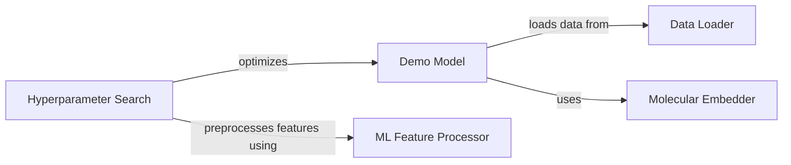

## Component Details

This component overview details the foundational elements of the system, focusing on data preparation, model initialization, and hyperparameter optimization. The primary flow involves loading a lipophilicity dataset, converting molecular structures into numerical fingerprints, and then either loading a pre-trained SVR model or training a new one with optimized hyperparameters. This ensures that the system has access to properly formatted data and a well-configured predictive model for subsequent tasks.

### Data Loader
Responsible for loading the lipophilicity dataset from a specified source, handling download if necessary.

**Related Classes/Methods**:

- <a href="https://github.com/Bayer-Group/mlr-xai-selfies/blob/master/xai_selfies/example.py#L21-L28" target="_blank" rel="noopener noreferrer">`mlr-xai-selfies.xai_selfies.example:read_data` (21:28)</a>

### Molecular Embedder
Converts SMILES strings into numerical molecular fingerprints using RDKit, specifically Morgan fingerprints.

**Related Classes/Methods**:

- <a href="https://github.com/Bayer-Group/mlr-xai-selfies/blob/master/xai_selfies/example.py#L31-L45" target="_blank" rel="noopener noreferrer">`mlr-xai-selfies.xai_selfies.example.RDKitEmbedder` (31:45)</a>
- <a href="https://github.com/Bayer-Group/mlr-xai-selfies/blob/master/xai_selfies/example.py#L36-L45" target="_blank" rel="noopener noreferrer">`mlr-xai-selfies.xai_selfies.example.RDKitEmbedder.encode` (36:45)</a>

### Demo Model
Encapsulates the demo machine learning model (SVR) and its prediction capabilities, including its initialization and training process.

**Related Classes/Methods**:

- <a href="https://github.com/Bayer-Group/mlr-xai-selfies/blob/master/xai_selfies/example.py#L48-L53" target="_blank" rel="noopener noreferrer">`mlr-xai-selfies.xai_selfies.example.Model` (48:53)</a>
- <a href="https://github.com/Bayer-Group/mlr-xai-selfies/blob/master/xai_selfies/example.py#L49-L50" target="_blank" rel="noopener noreferrer">`mlr-xai-selfies.xai_selfies.example.Model:__init__` (49:50)</a>
- <a href="https://github.com/Bayer-Group/mlr-xai-selfies/blob/master/xai_selfies/example.py#L52-L53" target="_blank" rel="noopener noreferrer">`mlr-xai-selfies.xai_selfies.example.Model:predict` (52:53)</a>
- <a href="https://github.com/Bayer-Group/mlr-xai-selfies/blob/master/xai_selfies/example.py#L56-L71" target="_blank" rel="noopener noreferrer">`mlr-xai-selfies.xai_selfies.example:get_demo_model` (56:71)</a>

### ML Feature Processor
Provides utilities for preprocessing features for machine learning models, handling different data types.

**Related Classes/Methods**:

- <a href="https://github.com/Bayer-Group/mlr-xai-selfies/blob/master/xai_selfies/ml_helper.py#L13-L34" target="_blank" rel="noopener noreferrer">`mlr-xai-selfies.xai_selfies.ml_helper.get_features` (13:34)</a>

### Hyperparameter Search
Manages the hyperparameter optimization process for machine learning models using techniques like HalvingRandomSearchCV and evaluates model performance.

**Related Classes/Methods**:

- <a href="https://github.com/Bayer-Group/mlr-xai-selfies/blob/master/xai_selfies/ml_helper.py#L100-L181" target="_blank" rel="noopener noreferrer">`mlr-xai-selfies.xai_selfies.ml_helper:hp_search_helper` (100:181)</a>

### [FAQ](https://github.com/CodeBoarding/GeneratedOnBoardings/tree/main?tab=readme-ov-file#faq)