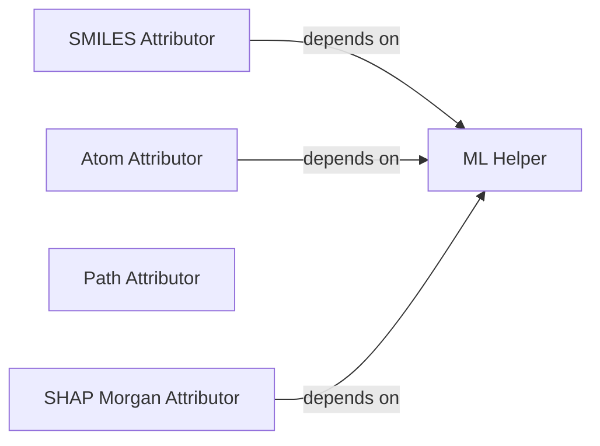

## Component Details

This graph represents the 'Molecular Attribution Methods' component, which provides various techniques for attributing model predictions back to molecular substructures or atoms. The main flow involves different attribution strategies: SMILES-based, atom-based, path-based, and SHAP with Morgan fingerprints. These strategies generate mutations or calculate scores to explain model predictions, often relying on a shared ML Helper component for feature extraction and model utility functions.

### SMILES Attributor
This component attributes importance to parts of SMILES strings by generating various mutations (substitutions) of the original SMILES. It then uses a predictor model to evaluate the impact of these mutations on the prediction, thereby quantifying the attribution of each part of the SMILES string. It also includes a utility to silence RDKit output during SMILES validation.

**Related Classes/Methods**:

- <a href="https://github.com/Bayer-Group/mlr-xai-selfies/blob/master/xai_selfies/smiles_attributor.py#L138-L156" target="_blank" rel="noopener noreferrer">`mlr-xai-selfies.xai_selfies.smiles_attributor:attribute_smiles` (138:156)</a>
- <a href="https://github.com/Bayer-Group/mlr-xai-selfies/blob/master/xai_selfies/smiles_attributor.py#L159-L247" target="_blank" rel="noopener noreferrer">`mlr-xai-selfies.xai_selfies.smiles_attributor:generate_mutations` (159:247)</a>
- <a href="https://github.com/Bayer-Group/mlr-xai-selfies/blob/master/xai_selfies/smiles_attributor.py#L130-L136" target="_blank" rel="noopener noreferrer">`mlr-xai-selfies.xai_selfies.smiles_attributor:predictor_smiles` (130:136)</a>
- <a href="https://github.com/Bayer-Group/mlr-xai-selfies/blob/master/xai_selfies/smiles_attributor.py#L88-L123" target="_blank" rel="noopener noreferrer">`mlr-xai-selfies.xai_selfies.smiles_attributor._Silencer` (88:123)</a>

### Atom Attributor
This component focuses on attributing importance to individual atoms within a molecule. It generates mutations by systematically replacing atoms with other organic atom symbols and then uses a predictor model to assess the change in prediction. This allows for the quantification of each atom's contribution to the overall prediction. It also uses a silencer for RDKit output.

**Related Classes/Methods**:

- <a href="https://github.com/Bayer-Group/mlr-xai-selfies/blob/master/xai_selfies/atom_attributor.py#L101-L120" target="_blank" rel="noopener noreferrer">`mlr-xai-selfies.xai_selfies.atom_attributor:attribute_atoms` (101:120)</a>
- <a href="https://github.com/Bayer-Group/mlr-xai-selfies/blob/master/xai_selfies/atom_attributor.py#L55-L89" target="_blank" rel="noopener noreferrer">`mlr-xai-selfies.xai_selfies.atom_attributor:mutate_atoms` (55:89)</a>
- <a href="https://github.com/Bayer-Group/mlr-xai-selfies/blob/master/xai_selfies/atom_attributor.py#L92-L98" target="_blank" rel="noopener noreferrer">`mlr-xai-selfies.xai_selfies.atom_attributor:predictor_on_smiles` (92:98)</a>
- <a href="https://github.com/Bayer-Group/mlr-xai-selfies/blob/master/xai_selfies/atom_attributor.py#L18-L53" target="_blank" rel="noopener noreferrer">`mlr-xai-selfies.xai_selfies.atom_attributor._Silencer` (18:53)</a>

### Path Attributor
This component is responsible for identifying all possible paths between atoms in a molecular graph and generating mutated molecules by removing atoms along these paths. It uses a Depth-First Search (DFS) algorithm to find paths and then applies atom removal to create mutations for attribution analysis.

**Related Classes/Methods**:

- <a href="https://github.com/Bayer-Group/mlr-xai-selfies/blob/master/xai_selfies/path_attributor.py#L4-L20" target="_blank" rel="noopener noreferrer">`mlr-xai-selfies.xai_selfies.path_attributor:find_all_paths` (4:20)</a>
- <a href="https://github.com/Bayer-Group/mlr-xai-selfies/blob/master/xai_selfies/path_attributor.py#L38-L59" target="_blank" rel="noopener noreferrer">`mlr-xai-selfies.xai_selfies.path_attributor:mutations_along_paths` (38:59)</a>

### SHAP Morgan Attributor
This component calculates SHAP (SHapley Additive exPlanations) attributions for molecular predictions, specifically leveraging Morgan fingerprints. It determines the contribution of each atom to the model's output by analyzing the coefficients derived from SHAP values and distributing them across the atoms based on their presence in fingerprint bits.

**Related Classes/Methods**:

- <a href="https://github.com/Bayer-Group/mlr-xai-selfies/blob/master/xai_selfies/SHAP_MORGAN_attributor.py#L45-L63" target="_blank" rel="noopener noreferrer">`mlr-xai-selfies.xai_selfies.SHAP_MORGAN_attributor:get_SHAP_Morgan_attributions` (45:63)</a>
- <a href="https://github.com/Bayer-Group/mlr-xai-selfies/blob/master/xai_selfies/SHAP_MORGAN_attributor.py#L34-L43" target="_blank" rel="noopener noreferrer">`mlr-xai-selfies.xai_selfies.SHAP_MORGAN_attributor:weights_morgan` (34:43)</a>
- <a href="https://github.com/Bayer-Group/mlr-xai-selfies/blob/master/xai_selfies/SHAP_MORGAN_attributor.py#L8-L32" target="_blank" rel="noopener noreferrer">`mlr-xai-selfies.xai_selfies.SHAP_MORGAN_attributor:calculate_atom_weights` (8:32)</a>

### ML Helper
This component provides foundational machine learning utility functions. It handles feature extraction from molecular data, including the generation of various types of fingerprints (Morgan, MACCS, RDKit), and offers a helper function for hyperparameter searching for machine learning models.

**Related Classes/Methods**:

- <a href="https://github.com/Bayer-Group/mlr-xai-selfies/blob/master/xai_selfies/ml_helper.py#L13-L34" target="_blank" rel="noopener noreferrer">`mlr-xai-selfies.xai_selfies.ml_helper.get_features` (13:34)</a>
- <a href="https://github.com/Bayer-Group/mlr-xai-selfies/blob/master/xai_selfies/ml_helper.py#L36-L55" target="_blank" rel="noopener noreferrer">`mlr-xai-selfies.xai_selfies.ml_helper.get_morgan_fingerprint` (36:55)</a>
- <a href="https://github.com/Bayer-Group/mlr-xai-selfies/blob/master/xai_selfies/ml_helper.py#L57-L76" target="_blank" rel="noopener noreferrer">`mlr-xai-selfies.xai_selfies.ml_helper.get_MACCS_fingerprint` (57:76)</a>
- <a href="https://github.com/Bayer-Group/mlr-xai-selfies/blob/master/xai_selfies/ml_helper.py#L79-L98" target="_blank" rel="noopener noreferrer">`mlr-xai-selfies.xai_selfies.ml_helper.get_RDK_fingerprint` (79:98)</a>
- <a href="https://github.com/Bayer-Group/mlr-xai-selfies/blob/master/xai_selfies/ml_helper.py#L100-L181" target="_blank" rel="noopener noreferrer">`mlr-xai-selfies.xai_selfies.ml_helper.hp_search_helper` (100:181)</a>

### [FAQ](https://github.com/CodeBoarding/GeneratedOnBoardings/tree/main?tab=readme-ov-file#faq)