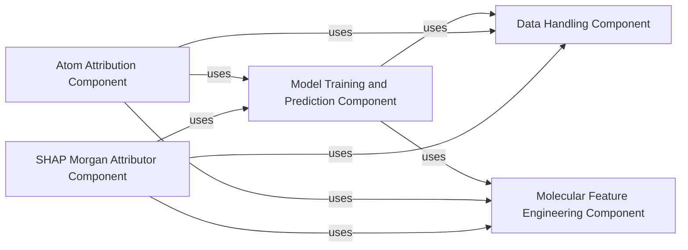

## Component Details

This graph illustrates the key components of a molecular machine learning system, focusing on data handling, molecular feature engineering, model training and prediction, and explainability through atom attribution and SHAP analysis for Morgan fingerprints. It highlights how these components interact to process molecular data, build predictive models, and provide insights into model decisions.

### Data Handling Component
This component is responsible for reading and preprocessing data, including downloading datasets, loading CSV files into pandas DataFrames, and extracting features from data based on specified columns, handling both numpy arrays and single-column values.

**Related Classes/Methods**:

- <a href="https://github.com/Bayer-Group/mlr-xai-selfies/blob/master/xai_selfies/example.py#L21-L28" target="_blank" rel="noopener noreferrer">`xai_selfies.example:read_data` (21:28)</a>
- <a href="https://github.com/Bayer-Group/mlr-xai-selfies/blob/master/xai_selfies/ml_helper.py#L13-L34" target="_blank" rel="noopener noreferrer">`xai_selfies.ml_helper:get_features` (13:34)</a>

### Molecular Feature Engineering Component
This component handles the transformation of molecular structures (SMILES) into numerical features suitable for machine learning models. It provides utilities for generating various types of molecular fingerprints, which are crucial for model input.

**Related Classes/Methods**:

- <a href="https://github.com/Bayer-Group/mlr-xai-selfies/blob/master/xai_selfies/example.py#L31-L45" target="_blank" rel="noopener noreferrer">`xai_selfies.example.RDKitEmbedder` (31:45)</a>
- <a href="https://github.com/Bayer-Group/mlr-xai-selfies/blob/master/xai_selfies/example.py#L36-L45" target="_blank" rel="noopener noreferrer">`xai_selfies.example.RDKitEmbedder:encode` (36:45)</a>
- <a href="https://github.com/Bayer-Group/mlr-xai-selfies/blob/master/xai_selfies/ml_helper.py#L36-L55" target="_blank" rel="noopener noreferrer">`xai_selfies.ml_helper:get_morgan_fingerprint` (36:55)</a>
- <a href="https://github.com/Bayer-Group/mlr-xai-selfies/blob/master/xai_selfies/ml_helper.py#L57-L76" target="_blank" rel="noopener noreferrer">`xai_selfies.ml_helper:get_MACCS_fingerprint` (57:76)</a>
- <a href="https://github.com/Bayer-Group/mlr-xai-selfies/blob/master/xai_selfies/ml_helper.py#L79-L98" target="_blank" rel="noopener noreferrer">`xai_selfies.ml_helper:get_RDK_fingerprint` (79:98)</a>

### Model Training and Prediction Component
This component encapsulates the core machine learning model functionalities, including training a demo model (SVR), making predictions, and handling model persistence. It also provides a helper function for hyperparameter search and cross-validation.

**Related Classes/Methods**:

- <a href="https://github.com/Bayer-Group/mlr-xai-selfies/blob/master/xai_selfies/example.py#L48-L53" target="_blank" rel="noopener noreferrer">`xai_selfies.example.Model` (48:53)</a>
- <a href="https://github.com/Bayer-Group/mlr-xai-selfies/blob/master/xai_selfies/example.py#L52-L53" target="_blank" rel="noopener noreferrer">`xai_selfies.example.Model:predict` (52:53)</a>
- <a href="https://github.com/Bayer-Group/mlr-xai-selfies/blob/master/xai_selfies/example.py#L56-L71" target="_blank" rel="noopener noreferrer">`xai_selfies.example:get_demo_model` (56:71)</a>
- <a href="https://github.com/Bayer-Group/mlr-xai-selfies/blob/master/xai_selfies/ml_helper.py#L100-L181" target="_blank" rel="noopener noreferrer">`xai_selfies.ml_helper:hp_search_helper` (100:181)</a>

### Atom Attribution Component
This component is responsible for attributing importance scores to individual atoms within a molecule based on a trained predictor. It involves mutating atoms and using the predictor to evaluate the impact of these mutations, providing insights into atomic contributions to model predictions.

**Related Classes/Methods**:

- <a href="https://github.com/Bayer-Group/mlr-xai-selfies/blob/master/xai_selfies/atom_attributor.py#L55-L89" target="_blank" rel="noopener noreferrer">`xai_selfies.atom_attributor:mutate_atoms` (55:89)</a>
- <a href="https://github.com/Bayer-Group/mlr-xai-selfies/blob/master/xai_selfies/atom_attributor.py#L92-L98" target="_blank" rel="noopener noreferrer">`xai_selfies.atom_attributor:predictor_on_smiles` (92:98)</a>
- <a href="https://github.com/Bayer-Group/mlr-xai-selfies/blob/master/xai_selfies/atom_attributor.py#L101-L120" target="_blank" rel="noopener noreferrer">`xai_selfies.atom_attributor:attribute_atoms` (101:120)</a>
- <a href="https://github.com/Bayer-Group/mlr-xai-selfies/blob/master/xai_selfies/atom_attributor.py#L18-L53" target="_blank" rel="noopener noreferrer">`xai_selfies.atom_attributor._Silencer` (18:53)</a>

### SHAP Morgan Attributor Component
This component specifically focuses on generating SHAP (SHapley Additive exPlanations) attributions for Morgan fingerprints. It leverages feature preparation and calculates attribution weights to provide explainability for models using Morgan fingerprints.

**Related Classes/Methods**:

- <a href="https://github.com/Bayer-Group/mlr-xai-selfies/blob/master/xai_selfies/SHAP_MORGAN_attributor.py#L8-L32" target="_blank" rel="noopener noreferrer">`xai_selfies.SHAP_MORGAN_attributor:calculate_atom_weights` (8:32)</a>
- <a href="https://github.com/Bayer-Group/mlr-xai-selfies/blob/master/xai_selfies/SHAP_MORGAN_attributor.py#L34-L43" target="_blank" rel="noopener noreferrer">`xai_selfies.SHAP_MORGAN_attributor:weights_morgan` (34:43)</a>
- <a href="https://github.com/Bayer-Group/mlr-xai-selfies/blob/master/xai_selfies/SHAP_MORGAN_attributor.py#L45-L63" target="_blank" rel="noopener noreferrer">`xai_selfies.SHAP_MORGAN_attributor:get_SHAP_Morgan_attributions` (45:63)</a>

### [FAQ](https://github.com/CodeBoarding/GeneratedOnBoardings/tree/main?tab=readme-ov-file#faq)