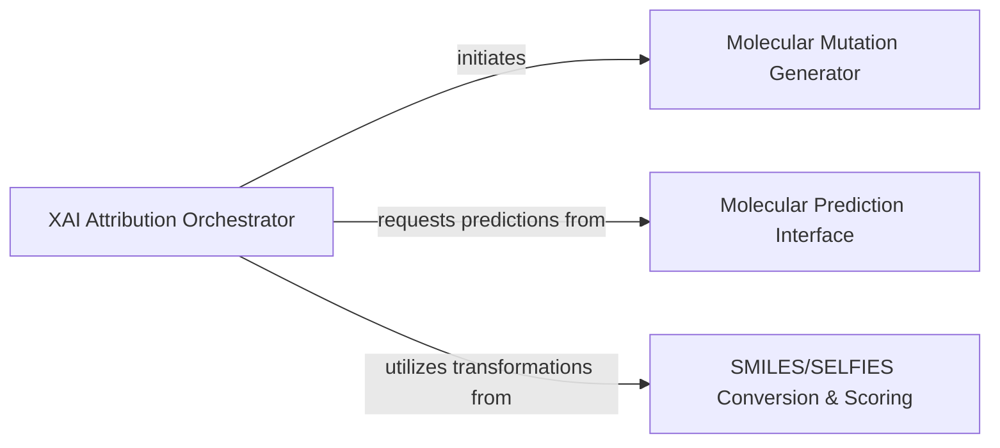

## Component Details

This graph represents the SELFIES Attribution Orchestration subsystem, which is responsible for generating SELFIES mutations, obtaining predictions, translating scores, and ordering results to provide atom-level attributions for molecules. The main flow starts with the XAI Attribution Orchestrator, which coordinates the mutation generation, prediction, and score conversion processes to produce a final attribution dataframe.

### XAI Attribution Orchestrator
This is the central control component that orchestrates the entire SELFIES-based attribution workflow. It manages the generation of SELFIES mutations, obtains predictions for original and mutated molecules, translates SELFIES-level scores to SMILES atom-level attributions, and handles canonical ordering of results, integrating various sub-processes to deliver the final attribution dataframe.

**Related Classes/Methods**:

- <a href="https://github.com/Bayer-Group/mlr-xai-selfies/blob/master/xai_selfies/main.py#L207-L267" target="_blank" rel="noopener noreferrer">`mlr-xai-selfies.xai_selfies.main:get_attributions_df` (207:267)</a>

### Molecular Mutation Generator
This component is responsible for generating various mutated forms of a given molecule in SELFIES format and filtering these mutations based on a specified similarity threshold to the original molecule.

**Related Classes/Methods**:

- <a href="https://github.com/Bayer-Group/mlr-xai-selfies/blob/master/xai_selfies/main.py#L147-L184" target="_blank" rel="noopener noreferrer">`mlr-xai-selfies.xai_selfies.main:get_all_mutations` (147:184)</a>
- <a href="https://github.com/Bayer-Group/mlr-xai-selfies/blob/master/xai_selfies/main.py#L44-L81" target="_blank" rel="noopener noreferrer">`mlr-xai-selfies.xai_selfies.main:get_mutated_selfies` (44:81)</a>
- <a href="https://github.com/Bayer-Group/mlr-xai-selfies/blob/master/xai_selfies/main.py#L84-L103" target="_blank" rel="noopener noreferrer">`mlr-xai-selfies.xai_selfies.main:filter_candidates` (84:103)</a>

### Molecular Prediction Interface
This component interfaces with a machine learning model and an embedder to obtain predictions for both original and mutated molecular structures.

**Related Classes/Methods**:

- <a href="https://github.com/Bayer-Group/mlr-xai-selfies/blob/master/xai_selfies/main.py#L187-L204" target="_blank" rel="noopener noreferrer">`mlr-xai-selfies.xai_selfies.main:get_predictions_for_mutants_and_original` (187:204)</a>

### SMILES/SELFIES Conversion & Scoring
This component handles the parsing, conversion, and reordering of chemical representations between SMILES and SELFIES formats, and manages the attribution scores associated with these transformations.

**Related Classes/Methods**:

- <a href="https://github.com/Bayer-Group/mlr-xai-selfies/blob/master/xai_selfies/main.py#L15-L26" target="_blank" rel="noopener noreferrer">`mlr-xai-selfies.xai_selfies.main:smiles_parser` (15:26)</a>
- <a href="https://github.com/Bayer-Group/mlr-xai-selfies/blob/master/xai_selfies/main.py#L106-L144" target="_blank" rel="noopener noreferrer">`mlr-xai-selfies.xai_selfies.main:score_from_selfies_to_smiles` (106:144)</a>
- <a href="https://github.com/Bayer-Group/mlr-xai-selfies/blob/master/xai_selfies/main.py#L29-L41" target="_blank" rel="noopener noreferrer">`mlr-xai-selfies.xai_selfies.main:get_correct_order` (29:41)</a>

### [FAQ](https://github.com/CodeBoarding/GeneratedOnBoardings/tree/main?tab=readme-ov-file#faq)