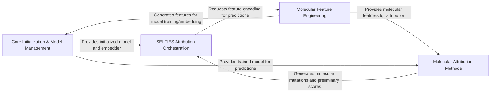

## Component Details

This graph represents the architecture of the `mlr-xai-selfies` project, which focuses on explainable AI for molecular machine learning, particularly using SELFIES for attribution. The main flow involves initializing models and data, generating molecular features, applying various attribution methods to understand model predictions, and orchestrating the SELFIES-based attribution workflow to provide atom-level insights into molecular properties.

### Core Initialization & Model Management
This component is responsible for setting up the foundational elements of the system, including reading input datasets, initializing or loading machine learning models, and optimizing their hyperparameters. It ensures that the necessary data and predictive models are prepared and optimally configured for subsequent use.

**Related Classes/Methods**:

- <a href="https://github.com/Bayer-Group/mlr-xai-selfies/blob/master/xai_selfies/example.py#L21-L28" target="_blank" rel="noopener noreferrer">`mlr-xai-selfies.xai_selfies.example:read_data` (21:28)</a>
- <a href="https://github.com/Bayer-Group/mlr-xai-selfies/blob/master/xai_selfies/example.py#L31-L45" target="_blank" rel="noopener noreferrer">`mlr-xai-selfies.xai_selfies.example.RDKitEmbedder` (31:45)</a>
- <a href="https://github.com/Bayer-Group/mlr-xai-selfies/blob/master/xai_selfies/example.py#L48-L53" target="_blank" rel="noopener noreferrer">`mlr-xai-selfies.xai_selfies.example.Model` (48:53)</a>
- <a href="https://github.com/Bayer-Group/mlr-xai-selfies/blob/master/xai_selfies/example.py#L56-L71" target="_blank" rel="noopener noreferrer">`mlr-xai-selfies.xai_selfies.example:get_demo_model` (56:71)</a>
- <a href="https://github.com/Bayer-Group/mlr-xai-selfies/blob/master/xai_selfies/ml_helper.py#L100-L181" target="_blank" rel="noopener noreferrer">`mlr-xai-selfies.xai_selfies.ml_helper:hp_search_helper` (100:181)</a>

### Molecular Feature Engineering
This component handles the transformation of molecular structures (SMILES) into numerical features suitable for machine learning models. It provides utilities for generating various types of molecular fingerprints, which are crucial for model input.

**Related Classes/Methods**:

- <a href="https://github.com/Bayer-Group/mlr-xai-selfies/blob/master/xai_selfies/ml_helper.py#L13-L34" target="_blank" rel="noopener noreferrer">`mlr-xai-selfies.xai_selfies.ml_helper:get_features` (13:34)</a>
- <a href="https://github.com/Bayer-Group/mlr-xai-selfies/blob/master/xai_selfies/ml_helper.py#L36-L55" target="_blank" rel="noopener noreferrer">`mlr-xai-selfies.xai_selfies.ml_helper:get_morgan_fingerprint` (36:55)</a>
- <a href="https://github.com/Bayer-Group/mlr-xai-selfies/blob/master/xai_selfies/ml_helper.py#L57-L76" target="_blank" rel="noopener noreferrer">`mlr-xai-selfies.xai_selfies.ml_helper:get_MACCS_fingerprint` (57:76)</a>
- <a href="https://github.com/Bayer-Group/mlr-xai-selfies/blob/master/xai_selfies/ml_helper.py#L79-L98" target="_blank" rel="noopener noreferrer">`mlr-xai-selfies.xai_selfies.ml_helper:get_RDK_fingerprint` (79:98)</a>
- <a href="https://github.com/Bayer-Group/mlr-xai-selfies/blob/master/xai_selfies/example.py#L36-L45" target="_blank" rel="noopener noreferrer">`mlr-xai-selfies.xai_selfies.example.RDKitEmbedder:encode` (36:45)</a>

### Molecular Attribution Methods
This component encompasses various techniques for attributing model predictions back to molecular substructures or atoms. It includes methods for generating mutations based on SMILES characters, individual atoms, or molecular paths, and calculating attribution scores using these mutations or SHAP.

**Related Classes/Methods**:

- <a href="https://github.com/Bayer-Group/mlr-xai-selfies/blob/master/xai_selfies/smiles_attributor.py#L138-L156" target="_blank" rel="noopener noreferrer">`mlr-xai-selfies.xai_selfies.smiles_attributor:attribute_smiles` (138:156)</a>
- <a href="https://github.com/Bayer-Group/mlr-xai-selfies/blob/master/xai_selfies/smiles_attributor.py#L159-L247" target="_blank" rel="noopener noreferrer">`mlr-xai-selfies.xai_selfies.smiles_attributor:generate_mutations` (159:247)</a>
- <a href="https://github.com/Bayer-Group/mlr-xai-selfies/blob/master/xai_selfies/smiles_attributor.py#L130-L136" target="_blank" rel="noopener noreferrer">`mlr-xai-selfies.xai_selfies.smiles_attributor:predictor_smiles` (130:136)</a>
- <a href="https://github.com/Bayer-Group/mlr-xai-selfies/blob/master/xai_selfies/smiles_attributor.py#L88-L123" target="_blank" rel="noopener noreferrer">`mlr-xai-selfies.xai_selfies.smiles_attributor._Silencer` (88:123)</a>
- <a href="https://github.com/Bayer-Group/mlr-xai-selfies/blob/master/xai_selfies/atom_attributor.py#L101-L120" target="_blank" rel="noopener noreferrer">`mlr-xai-selfies.xai_selfies.atom_attributor:attribute_atoms` (101:120)</a>
- <a href="https://github.com/Bayer-Group/mlr-xai-selfies/blob/master/xai_selfies/atom_attributor.py#L55-L89" target="_blank" rel="noopener noreferrer">`mlr-xai-selfies.xai_selfies.atom_attributor:mutate_atoms` (55:89)</a>
- <a href="https://github.com/Bayer-Group/mlr-xai-selfies/blob/master/xai_selfies/atom_attributor.py#L92-L98" target="_blank" rel="noopener noreferrer">`mlr-xai-selfies.xai_selfies.atom_attributor:predictor_on_smiles` (92:98)</a>
- <a href="https://github.com/Bayer-Group/mlr-xai-selfies/blob/master/xai_selfies/atom_attributor.py#L18-L53" target="_blank" rel="noopener noreferrer">`mlr-xai-selfies.xai_selfies.atom_attributor._Silencer` (18:53)</a>
- <a href="https://github.com/Bayer-Group/mlr-xai-selfies/blob/master/xai_selfies/path_attributor.py#L4-L20" target="_blank" rel="noopener noreferrer">`mlr-xai-selfies.xai_selfies.path_attributor:find_all_paths` (4:20)</a>
- <a href="https://github.com/Bayer-Group/mlr-xai-selfies/blob/master/xai_selfies/path_attributor.py#L38-L59" target="_blank" rel="noopener noreferrer">`mlr-xai-selfies.xai_selfies.path_attributor:mutations_along_paths` (38:59)</a>
- <a href="https://github.com/Bayer-Group/mlr-xai-selfies/blob/master/xai_selfies/SHAP_MORGAN_attributor.py#L45-L63" target="_blank" rel="noopener noreferrer">`mlr-xai-selfies.xai_selfies.SHAP_MORGAN_attributor:get_SHAP_Morgan_attributions` (45:63)</a>
- <a href="https://github.com/Bayer-Group/mlr-xai-selfies/blob/master/xai_selfies/SHAP_MORGAN_attributor.py#L34-L43" target="_blank" rel="noopener noreferrer">`mlr-xai-selfies.xai_selfies.SHAP_MORGAN_attributor:weights_morgan` (34:43)</a>
- <a href="https://github.com/Bayer-Group/mlr-xai-selfies/blob/master/xai_selfies/SHAP_MORGAN_attributor.py#L8-L32" target="_blank" rel="noopener noreferrer">`mlr-xai-selfies.xai_selfies.SHAP_MORGAN_attributor:calculate_atom_weights` (8:32)</a>

### SELFIES Attribution Orchestration
This is the central control component that orchestrates the entire SELFIES-based attribution workflow. It manages the generation of SELFIES mutations, obtains predictions for original and mutated molecules, translates SELFIES-level scores to SMILES atom-level attributions, and handles canonical ordering of results, integrating various sub-processes to deliver the final attribution dataframe.

**Related Classes/Methods**:

- <a href="https://github.com/Bayer-Group/mlr-xai-selfies/blob/master/xai_selfies/main.py#L207-L267" target="_blank" rel="noopener noreferrer">`mlr-xai-selfies.xai_selfies.main:get_attributions_df` (207:267)</a>
- <a href="https://github.com/Bayer-Group/mlr-xai-selfies/blob/master/xai_selfies/main.py#L147-L184" target="_blank" rel="noopener noreferrer">`mlr-xai-selfies.xai_selfies.main:get_all_mutations` (147:184)</a>
- <a href="https://github.com/Bayer-Group/mlr-xai-selfies/blob/master/xai_selfies/main.py#L44-L81" target="_blank" rel="noopener noreferrer">`mlr-xai-selfies.xai_selfies.main:get_mutated_selfies` (44:81)</a>
- <a href="https://github.com/Bayer-Group/mlr-xai-selfies/blob/master/xai_selfies/main.py#L84-L103" target="_blank" rel="noopener noreferrer">`mlr-xai-selfies.xai_selfies.main:filter_candidates` (84:103)</a>
- <a href="https://github.com/Bayer-Group/mlr-xai-selfies/blob/master/xai_selfies/main.py#L106-L144" target="_blank" rel="noopener noreferrer">`mlr-xai-selfies.xai_selfies.main:score_from_selfies_to_smiles` (106:144)</a>
- <a href="https://github.com/Bayer-Group/mlr-xai-selfies/blob/master/xai_selfies/main.py#L15-L26" target="_blank" rel="noopener noreferrer">`mlr-xai-selfies.xai_selfies.main:smiles_parser` (15:26)</a>
- <a href="https://github.com/Bayer-Group/mlr-xai-selfies/blob/master/xai_selfies/main.py#L29-L41" target="_blank" rel="noopener noreferrer">`mlr-xai-selfies.xai_selfies.main:get_correct_order` (29:41)</a>
- <a href="https://github.com/Bayer-Group/mlr-xai-selfies/blob/master/xai_selfies/main.py#L187-L204" target="_blank" rel="noopener noreferrer">`mlr-xai-selfies.xai_selfies.main:get_predictions_for_mutants_and_original` (187:204)</a>

### [FAQ](https://github.com/CodeBoarding/GeneratedOnBoardings/tree/main?tab=readme-ov-file#faq)